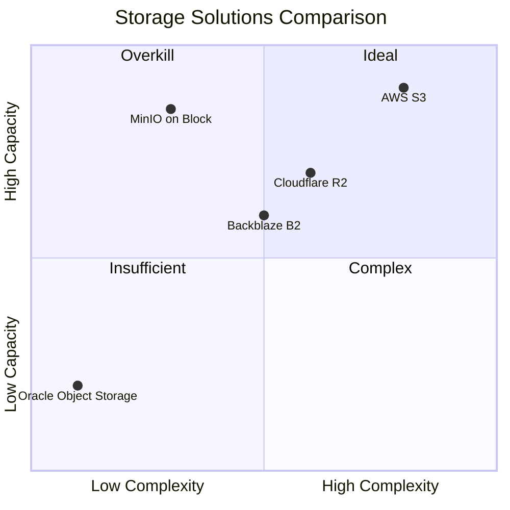
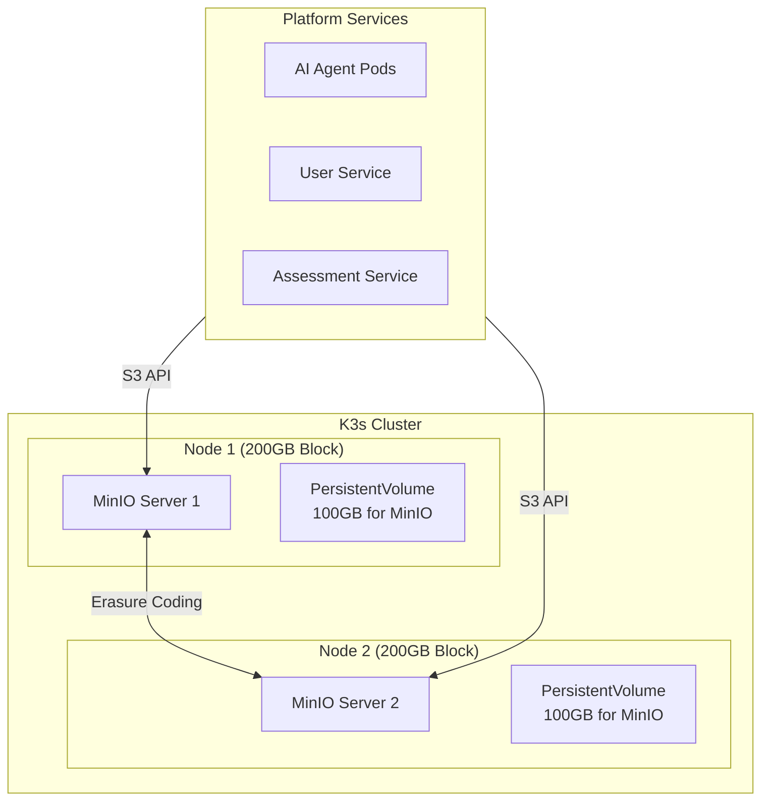

# ADR-012: MinIO on OCI Block Storage for Object Storage

## Status
**Accepted**

## Date
2026-01-05

## Context

Talent Mesh requires S3-compatible object storage for:
- Assessment recordings (video/audio files, ~200-500MB each)
- Candidate CVs and documents
- Verification documents (salary slips, certificates)
- Assessment artifacts and reports

### Storage Requirements Analysis

| Content Type | Size per Item | Monthly Volume (MVP) | Total Storage |
|--------------|---------------|---------------------|---------------|
| Assessment recordings | 200-500 MB | 100 assessments | 20-50 GB |
| CVs and documents | 1-5 MB | 500 candidates | 2.5 GB |
| Verification docs | 2-10 MB | 200 verifications | 2 GB |
| **Total** | - | - | **~55 GB/month** |

### Oracle Object Storage Limitation

Oracle Cloud Always Free provides only **20GB of Object Storage** combined across all tiers. This is insufficient for our needs:
- 20GB would only hold ~40-100 assessment recordings
- Would require frequent deletion or archival
- Adds operational complexity

### Alternatives Considered



## Decision

We will deploy **MinIO on OCI Block Storage** for all object storage needs.

### Architecture



### Storage Allocation

| Node | Total Block Storage | PostgreSQL | MongoDB | MinIO | Redis/Other |
|------|---------------------|------------|---------|-------|-------------|
| Node 1 | 200 GB | 30 GB | 30 GB | 100 GB | 40 GB |
| Node 2 | 200 GB | 30 GB | 30 GB | 100 GB | 40 GB |
| **Total** | **400 GB** | 60 GB | 60 GB | **200 GB** | 80 GB |

### MinIO Configuration

```yaml
apiVersion: apps/v1
kind: StatefulSet
metadata:
  name: minio
  namespace: talent-mesh
spec:
  serviceName: minio
  replicas: 2
  selector:
    matchLabels:
      app: minio
  template:
    metadata:
      labels:
        app: minio
    spec:
      affinity:
        podAntiAffinity:
          requiredDuringSchedulingIgnoredDuringExecution:
          - labelSelector:
              matchLabels:
                app: minio
            topologyKey: kubernetes.io/hostname
      containers:
      - name: minio
        image: minio/minio:latest
        args:
        - server
        - http://minio-{0...1}.minio.talent-mesh.svc.cluster.local/data
        - --console-address
        - ":9001"
        env:
        - name: MINIO_ROOT_USER
          valueFrom:
            secretKeyRef:
              name: minio-credentials
              key: root-user
        - name: MINIO_ROOT_PASSWORD
          valueFrom:
            secretKeyRef:
              name: minio-credentials
              key: root-password
        ports:
        - containerPort: 9000
          name: api
        - containerPort: 9001
          name: console
        volumeMounts:
        - name: data
          mountPath: /data
        resources:
          requests:
            cpu: 250m
            memory: 512Mi
          limits:
            cpu: 1000m
            memory: 2Gi
  volumeClaimTemplates:
  - metadata:
      name: data
    spec:
      accessModes: ["ReadWriteOnce"]
      storageClassName: local-path
      resources:
        requests:
          storage: 100Gi
---
apiVersion: v1
kind: Service
metadata:
  name: minio
  namespace: talent-mesh
spec:
  selector:
    app: minio
  ports:
  - port: 9000
    name: api
  - port: 9001
    name: console
  clusterIP: None
---
apiVersion: v1
kind: Service
metadata:
  name: minio-api
  namespace: talent-mesh
spec:
  selector:
    app: minio
  ports:
  - port: 9000
    name: api
  type: ClusterIP
```

### Bucket Structure

```mermaid
mindmap
  root((MinIO Buckets))
    recordings
      assessments/
        {assessment-id}/
          video.webm
          audio.wav
          transcript.json
    documents
      cvs/
        {user-id}/
          cv.pdf
      verifications/
        {user-id}/
          salary-slip.pdf
          certificate.pdf
    exports
      reports/
        {assessment-id}/
          spider-map.json
          report.pdf
```

### Lifecycle Policies

| Bucket | Retention | Action |
|--------|-----------|--------|
| `recordings` | 90 days | Move to archive tier, delete after 1 year |
| `documents` | Indefinite | Versioning enabled |
| `exports` | 30 days | Auto-delete |

## Consequences

### Positive

- **200GB usable storage** (vs. 20GB Oracle Object Storage)
- **Zero additional cost** - uses existing block storage allocation
- **S3-compatible API** - standard AWS SDK works
- **Data locality** - recordings stay within cluster
- **Erasure coding** - data protection across nodes
- **Self-contained** - no external dependencies
- **Consistent latency** - local storage vs. network calls

### Negative

- **Limited to block storage capacity** - 200GB total, must monitor
- **Operational overhead** - must manage MinIO ourselves
- **No global CDN** - recordings served from cluster
- **Backup responsibility** - must implement backup strategy
- **Single region** - no geo-replication

### Mitigations

- **Monitoring**: Alert at 70% capacity
- **Cleanup jobs**: Automated lifecycle policies
- **Backup**: Weekly backup to Cloudflare R2 (zero egress cost)
- **Future scaling**: Add nodes or migrate to cloud object storage when paid tier

## Comparison with Alternatives

| Aspect | MinIO on Block | Oracle Object Storage | Cloudflare R2 |
|--------|----------------|----------------------|---------------|
| Capacity | 200 GB | 20 GB | 10 GB free |
| Cost | $0 | $0 | $0.015/GB after free |
| Latency | < 10ms | ~50-100ms | ~50-100ms |
| Egress | Free | 10TB free | Free |
| Complexity | Medium | Low | Low |
| S3 Compatible | Yes | Yes | Yes |
| Self-hosted | Yes | No | No |

## Implementation Plan

1. **Phase 1**: Provision PersistentVolumes on each node (100GB each)
2. **Phase 2**: Deploy MinIO StatefulSet with pod anti-affinity
3. **Phase 3**: Create buckets and access policies
4. **Phase 4**: Configure lifecycle policies
5. **Phase 5**: Update services to use MinIO endpoint
6. **Phase 6**: Set up monitoring and alerting

## References

- [MinIO Documentation](https://min.io/docs/minio/linux/index.html)
- [MinIO Kubernetes Deployment](https://min.io/docs/minio/kubernetes/upstream/index.html)
- [ADR-014: Contabo VPS Infrastructure](./ADR-014-CONTABO-VPS-INFRASTRUCTURE.md)
- [DATA_ARCHITECTURE.md](../03-architecture/DATA_ARCHITECTURE.md)
