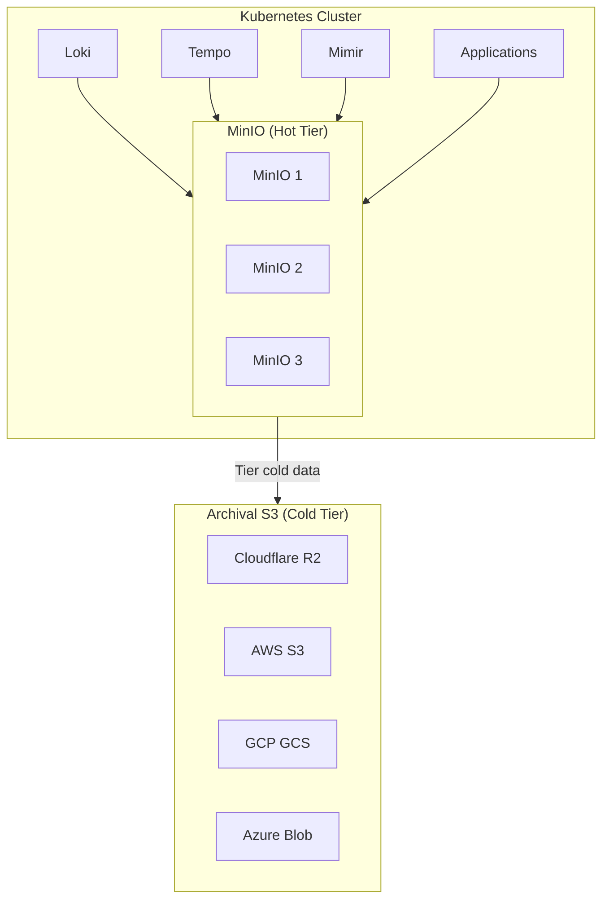
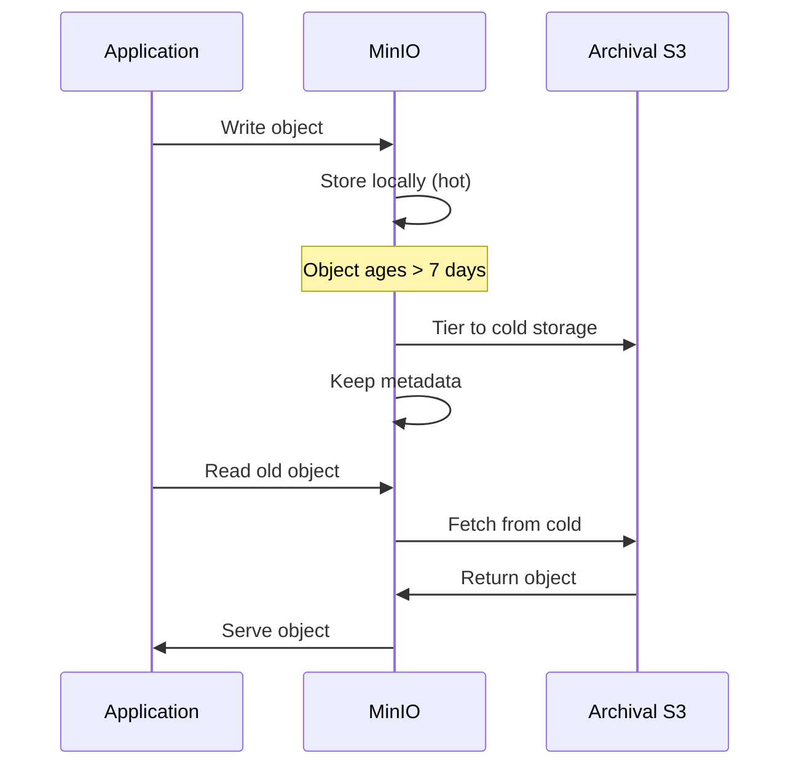
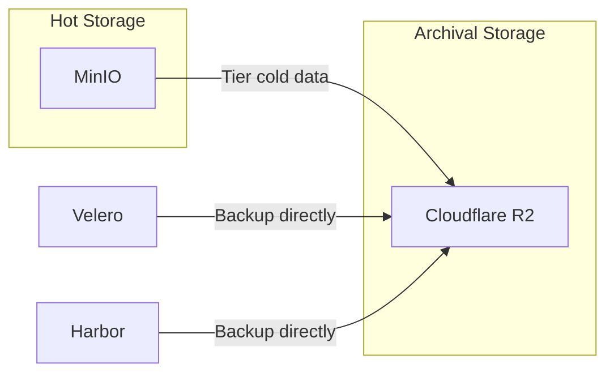

# ADR: Object Storage with MinIO (Tiered)

**Status:** Accepted
**Date:** 2024-04-01
**Updated:** 2026-01-16

## Context

Need S3-compatible object storage for observability backends and application data, with tiering to external archival storage for cost optimization.

## Decision

Use **MinIO** as fast in-cluster S3 storage with **tiered storage** to external archival S3 (Cloudflare R2, AWS S3, etc.).

## Architecture



## Tiered Storage Strategy

| Tier | Storage | Latency | Cost | Data Age |
|------|---------|---------|------|----------|
| Hot | MinIO (local SSD) | < 1ms | Included | < 7 days |
| Cold | Archival S3 | 50-200ms | Low | > 7 days |

### How Tiering Works



## Archival S3 Options

| Provider | Availability | Cost | Egress |
|----------|--------------|------|--------|
| Cloud Provider Storage | Default for chosen provider | Varies | Varies |
| Cloudflare R2 | Always available (option) | Low | Free |

**Default:** Cloud provider's object storage (Hetzner Object Storage, OCI Object Storage, Huawei OBS, etc.)

**Alternative:** Cloudflare R2 (zero egress fees, useful for multi-cloud scenarios)

## Configuration

### MinIO Deployment

```yaml
apiVersion: apps/v1
kind: StatefulSet
metadata:
  name: minio
  namespace: storage
spec:
  replicas: 3
  template:
    spec:
      containers:
        - name: minio
          image: minio/minio:latest
          args:
            - server
            - --console-address=:9001
            - http://minio-{0...2}.minio.storage:9000/data
          env:
            - name: MINIO_ROOT_USER
              valueFrom:
                secretKeyRef:
                  name: minio-credentials
                  key: root-user
            - name: MINIO_ROOT_PASSWORD
              valueFrom:
                secretKeyRef:
                  name: minio-credentials
                  key: root-password
          volumeMounts:
            - name: data
              mountPath: /data
```

### Tiering Configuration

```bash
# Add remote tier (Cloudflare R2)
mc admin tier add minio minio-cluster REMOTE_R2 \
  --endpoint https://<account>.r2.cloudflarestorage.com \
  --access-key $R2_ACCESS_KEY \
  --secret-key $R2_SECRET_KEY \
  --bucket archival

# Set lifecycle rule for tiering
mc ilm tier add minio-cluster/loki-chunks \
  --tier REMOTE_R2 \
  --transition-days 7
```

### Lifecycle Rules

```yaml
# mc ilm export minio-cluster/loki-chunks
{
  "Rules": [
    {
      "ID": "tier-to-archival",
      "Status": "Enabled",
      "Transition": {
        "Days": 7,
        "StorageClass": "REMOTE_R2"
      }
    },
    {
      "ID": "expire-old-data",
      "Status": "Enabled",
      "Expiration": {
        "Days": 365
      }
    }
  ]
}
```

## Bucket Structure

| Bucket | Purpose | Hot Retention | Total Retention |
|--------|---------|---------------|-----------------|
| `loki-chunks` | Log storage | 7 days | 90 days |
| `tempo-traces` | Trace storage | 7 days | 30 days |
| `mimir-blocks` | Metrics storage | 7 days | 365 days |
| `harbor-registry` | Container images | 30 days | 365 days |
| `<tenant>-data` | Application data | Configurable | Configurable |

## Important Clarification

**MinIO is NOT the backup target.**

- MinIO = Fast S3 for hot data (observability, apps)
- Archival S3 = Cold storage + backup target
- Velero backups go directly to Archival S3



## High Availability

- 3 MinIO instances
- Erasure coding (EC:2) for durability
- Survives 1 node failure

## Consequences

**Positive:**
- Fast local access for observability
- Cost-effective tiering to archival
- S3-compatible API
- HA via erasure coding

**Negative:**
- Uses local disk space
- Tiering adds complexity
- Self-managed

## Related

- [ADR-BACKUP](../../velero/docs/ADR-BACKUP.md)
- [ADR-OBSERVABILITY-STACK](../../grafana/docs/ADR-OBSERVABILITY-STACK.md)
